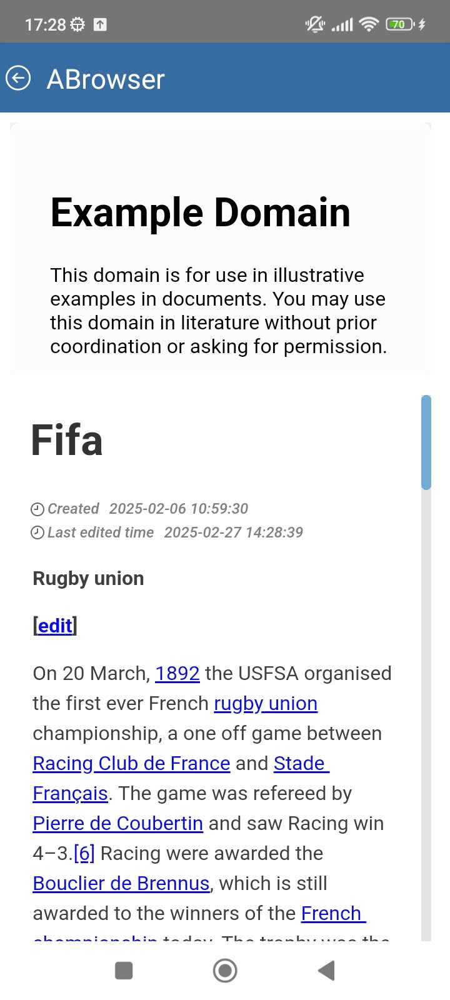

# ABrowser

## Giới thiệu

&#x20;Để hiển thị link website lên trên app

## 2. Khai báo xml

ABrowser thuộc loại field

Các giá trị cần khai

* **name:** tên field để component nhận data, valForm, formFieldValueChange
* **width**: quy định độ rộng của component (ở đây là frame)
* **componentName:** ABrowser

## 3. Data

AComponent này đọc data từ field name

## 4. Css

Khai báo được các css về chiều cao, height

## 5. Ví dụ


```xml
<?xml version="1.0" encoding="utf-8"?>
<!DOCTYPE dir [

	<!ENTITY DefaultButton SYSTEM "..\Include\XML\DefaultButtonDir.xml">
	<!ENTITY QRCodeScan SYSTEM "..\Include\Script\QRCodeScan.txt">
]>
<dir id="@@controller" fieldKey="id" >
	<title v="ABrowser" e="" o=""></title>
	<forms>
		<form>
			<formGroup>
				<fields>
					<field name="link1" width="100%" componentName="ABrowser">
						<text v="Example" e="" o="" />
					</field>
					<field name="link2" width="100%" componentName="ABrowser" fieldClass="height_300">
						<text v="fifa" e="" o="" />
					</field>
					<field name="changeLink1" width="100%" componentName="AButton">
						<text v="Change link1 value" e="" o="" />
					</field>
					<field name="getLink2" width="100%" componentName="AButton">
						<text v="get link 2 value" e="" o="" />
					</field>
				</fields>
			</formGroup>
		</form>
	</forms>
	<script>
		<query>
			<text>
				<![CDATA[
select 'https://example.com/' as link1, 'https://wiki.arito.vn/view/6725a950cd089998a859372e' as link2
    ]]>
			</text>
		</query>
	</script>
	<css>
		<text>
			<![CDATA[ 
{
  "height_300":{
    "height":300
  }
}
    ]]>
		</text>
	</css>
	<js>
		<text>
			<![CDATA[  
beforeButtonDialogClick=(id,p)=>{
    if(id=="changeLink1"){
       p.valForm("link1","https://en.wikipedia.org/wiki/John_von_Neumann")
    } 
     if(id=="getLink2"){
      let link = p.valForm("link2");
	  alert(link)
    } 
    return true;
}
      ]]>
		</text>
	</js>
	<buttons>
		<button id="cancel" image="arrow-left-circle">
			<text v="" e="" o=""></text>
		</button>
	</buttons>
</dir>
```


<figure><figcaption></figcaption></figure>
